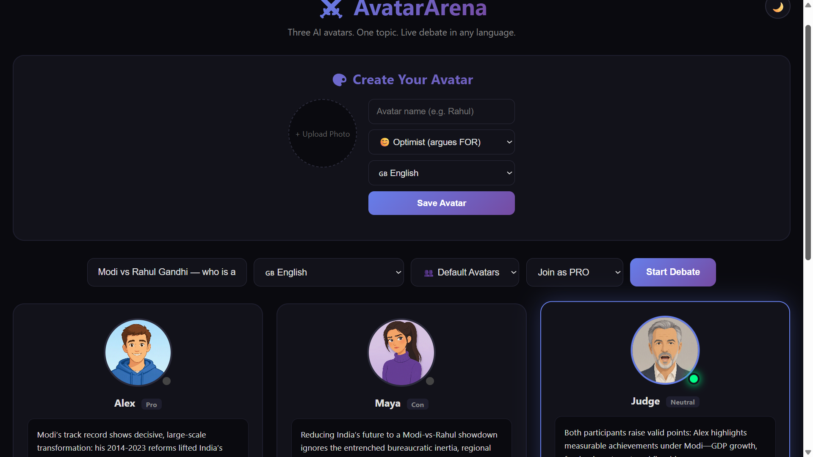
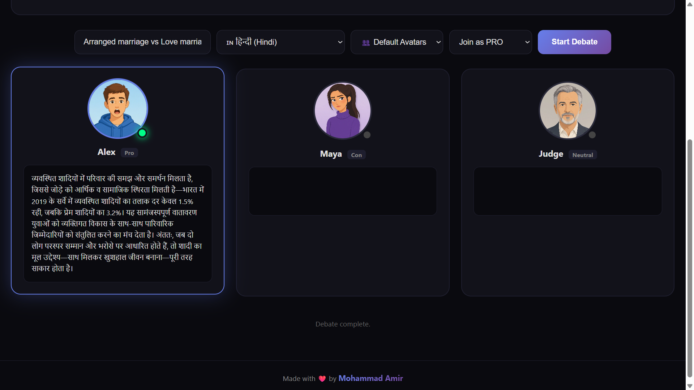
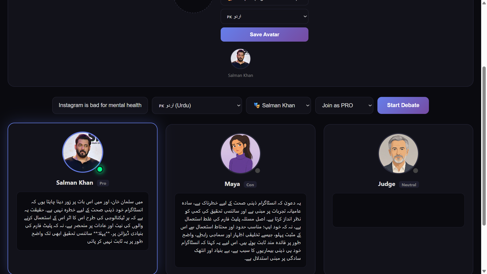
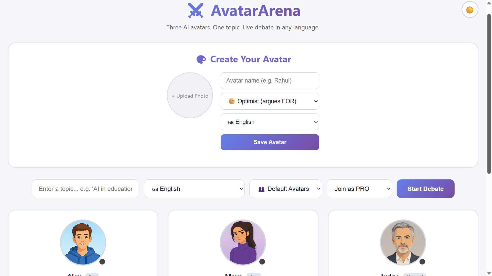

<div align="center">

# ⚔️ AvatarArena

### Three AI avatars. One topic. Live debate in 20+ languages.

[](https://avatar-arena.onrender.com)
[](https://www.python.org/)
[](https://fastapi.tiangolo.com/)
[](https://groq.com/)
[](LICENSE)

**Made by [Mohammad Amir](https://github.com/Mohammad-Amir-tech)**

</div>

---

## 📖 Table of Contents

* [What is AvatarArena?](#-what-is-avatararena)
* [Live Demo](#-live-demo)
* [Features](#-features)
* [Tech Stack](#️-tech-stack)
* [Architecture](#️-architecture)
* [Screenshots](#-screenshots)
* [Local Setup](#-local-setup)
* [Project Structure](#-project-structure)
* [Supported Languages](#-supported-languages)
* [How It Works](#-how-it-works)
* [Roadmap](#-roadmap)
* [Contributing](#-contributing)
* [License](#-license)
* [Author](#-author)
* [Acknowledgments](#-acknowledgments)

---

## 🎯 What is AvatarArena?

**AvatarArena** is a **multi-agent AI debate platform** where three AI-powered avatars engage in structured debates on any topic you choose.

Unlike a traditional chatbot, AvatarArena creates a **real-time AI conversation** with distinct personalities, voices, animated avatars, and multilingual support.

### The Three Debaters

| Avatar          | Role    | Personality                                           |
| --------------- | ------- | ----------------------------------------------------- |
| 🧑 **Alex**     | Pro     | Optimistic, evidence-driven, argues FOR the topic     |
| 👩 **Maya**     | Con     | Skeptical, critical thinker, argues AGAINST the topic |
| 👨‍⚖️ **Judge** | Neutral | Balanced, evaluates both sides and delivers a verdict |

**Plus:** You can create your own custom avatar and join the debate.

---

## 🚀 Live Demo

🌐 **[Launch AvatarArena](https://avatar-arena.onrender.com)**


### Try These Topics

| Language      | Example Topic        | Experience                        |
| ------------- | -------------------- | --------------------------------- |
| 🇬🇧 English  | `AI in education`    | Full English debate               |
| 🇮🇳 Hindi    | `शिक्षा में AI`      | Hindi debate with Devanagari text |
| 🇵🇰 Urdu     | `تعلیم میں AI`       | RTL Urdu debate                   |
| 🇮🇳 Tamil    | `கல்வியில் AI`       | Tamil text + voice                |
| 🇪🇸 Spanish  | `IA en la educación` | Spanish debate                    |
| 🇯🇵 Japanese | `教育におけるAI`           | Japanese debate                   |

---

## ✨ Features

### 🎭 AI Debate

* **3 AI Personalities** — Alex, Maya, and Judge
* **Structured Debate** — 5-turn debate format
* **Pro vs Con Reasoning** — Arguments and counterarguments
* **AI Judge** — Balanced final evaluation
* **Debate History Context** — Each AI agent receives the conversation history
* **Real-time Streaming** — Responses stream using Server-Sent Events (SSE)

### 🌍 Multilingual Support

* **20+ Languages**
* English
* Hindi
* Urdu
* Bengali
* Tamil
* Telugu
* Marathi
* Gujarati
* Kannada
* Malayalam
* Punjabi
* Hinglish
* Spanish
* French
* German
* Japanese
* Korean
* Chinese
* Arabic
* Russian
* **Native TTS Voices**
* **RTL Support** for Urdu and Arabic
* Manual language selection

### 🎨 Custom Avatars

* Upload your own avatar image
* Choose avatar personality
* Optimist / Skeptic / Neutral personality modes
* Select debate language
* Persistent avatar storage using SQLite
* Delete custom avatars anytime

### 🎬 Animation & Audio

* Real-time mouth movement
* Web Audio API amplitude analysis
* Three mouth animation states
* Silent / Half-Open / Wide-Open states
* Amplitude smoothing for natural movement
* Speaking indicators
* Avatar glow effects

### 🎨 User Experience

* Dark / Light mode
* Responsive design
* Desktop, tablet and mobile support
* Glassmorphism UI
* Gradient-based visual design
* Smooth CSS animations
* Real-time status feedback
* Modern card-based interface

---

## 🛠️ Tech Stack

### Backend

| Technology              | Purpose                           |
| ----------------------- | --------------------------------- |
| **Python 3.11**         | Backend programming language      |
| **FastAPI**             | Modern asynchronous web framework |
| **Groq AI**             | Fast LLM inference                |
| **openai/gpt-oss-120b** | AI debate generation              |
| **edge-tts**            | Multilingual text-to-speech       |
| **SQLite**              | Custom avatar persistence         |
| **Uvicorn**             | ASGI server                       |
| **SSE**                 | Real-time response streaming      |

### Frontend

| Technology          | Purpose                        |
| ------------------- | ------------------------------ |
| **HTML5**           | Application structure          |
| **CSS3**            | Styling, themes and animations |
| **JavaScript**      | Client-side application logic  |
| **Web Audio API**   | Audio amplitude analysis       |
| **EventSource API** | SSE streaming client           |

### Deployment & Tools

| Service         | Purpose                         |
| --------------- | ------------------------------- |
| **Render**      | Application hosting             |
| **GitHub**      | Source code and version control |
| **UptimeRobot** | Optional uptime monitoring      |

---

## 🏗️ Architecture

```text
┌──────────────────────────────────────────────────────────┐
│                     USER INTERFACE                       │
│                                                          │
│   ┌───────────┐    ┌───────────┐    ┌──────────────┐     │
│   │   Alex    │    │   Maya    │    │    Judge     │     │
│   │   PRO     │    │   CON     │    │   NEUTRAL    │     │
│   └─────┬─────┘    └─────┬─────┘    └──────┬───────┘     │
│         │                │                 │             │
└─────────┼────────────────┼─────────────────┼─────────────┘
          │                │                 │
          └────────────────┼─────────────────┘
                           │
                     SSE STREAM
                           │
                           ▼
┌──────────────────────────────────────────────────────────┐
│                    FASTAPI BACKEND                       │
│                                                          │
│              ┌──────────────────────────┐                │
│              │   DEBATE ORCHESTRATOR    │                │
│              │                          │                │
│              │ Turn 1 → Pro             │                │
│              │ Turn 2 → Con             │                │
│              │ Turn 3 → Pro             │                │
│              │ Turn 4 → Con             │                │
│              │ Turn 5 → Judge           │                │
│              └────────────┬─────────────┘                │
│                           │                              │
│            ┌──────────────┼──────────────┐               │
│            ▼              ▼              ▼               │
│       ┌─────────┐   ┌───────────┐   ┌─────────┐          │
│       │ Groq AI │   │ edge-tts  │   │ SQLite  │          │
│       │   LLM   │   │   Voice   │   │   DB    │          │
│       └─────────┘   └───────────┘   └─────────┘          │
│                                                          │
└──────────────────────────────────────────────────────────┘
                           │
                           ▼
┌──────────────────────────────────────────────────────────┐
│                   AUDIO ANALYZER                         │
│                                                          │
│              Web Audio API                               │
│              ├── FFT Analysis                            │
│              ├── Amplitude Calculation                   │
│              └── Amplitude Smoothing                     │
│                                                          │
└──────────────────────────┬───────────────────────────────┘
                           │
                           ▼
┌──────────────────────────────────────────────────────────┐
│                   MOUTH ANIMATION                        │
│                                                          │
│              Silent       < 10                           │
│              Half-Open    10–50                          │
│              Wide-Open    > 50                           │
│                                                          │
└──────────────────────────────────────────────────────────┘
```

---

## 📸 Screenshots

### Main Interface — English Debate



### Hindi Debate — Multilingual Support



### Custom Avatar Creator



### Light Mode




---

## 📦 Local Setup

### Prerequisites

Make sure you have:

* **Python 3.11+**
* **Git**
* **Groq API Key**

### 1. Clone the Repository

```bash
git clone https://github.com/Mohammad-Amir-tech/Avatar-Arena.git
cd Avatar-Arena
```

### 2. Install Backend Dependencies

```bash
cd backend
pip install -r requirements.txt
```

### 3. Configure Environment Variables

Create a `.env` file inside the `backend` folder:

```env
GROQ_API_KEY=your_groq_api_key_here
GROQ_MODEL=openai/gpt-oss-120b
```

> ⚠️ Never commit your real `.env` file or API key to GitHub.

### 4. Start the Server

```bash
python main.py
```

### 5. Open the Application

Open your browser and visit:

```text
http://localhost:8000
```

---

## 🔧 Troubleshooting

| Problem                      | Solution                                                |
| ---------------------------- | ------------------------------------------------------- |
| `No module named 'edge_tts'` | Run `pip install edge-tts --upgrade`                    |
| `GROQ_API_KEY missing`       | Check the `.env` file inside `backend/`                 |
| Connection error             | Verify your internet connection and API key             |
| TTS error                    | Upgrade edge-tts using `pip install --upgrade edge-tts` |
| Server doesn't start         | Verify Python version and installed dependencies        |

---

## 📁 Project Structure

```text
Avatar-Arena/
│
├── backend/
│   ├── main.py
│   ├── requirements.txt
│   ├── runtime.txt
│   ├── users.db
│   │
│   └── frontend/
│       ├── index.html
│       ├── style.css
│       ├── script.js
│       │
│       └── avatars/
│           ├── pro.jpg
│           ├── pro-mouth-half.jpg
│           ├── pro-mouth-open.jpg
│           │
│           ├── conn.jpg
│           ├── conn-mouth-half.jpg
│           ├── conn-mouth-open.jpg
│           │
│           ├── judge.jpg
│           ├── judge-mouth-half.jpg
│           └── judge-mouth-open.jpg
│
├── screenshots/
│   ├── screenshot-english.png
│   ├── screenshot-hindi.png
│   ├── screenshot-avatar.png
│   └── screenshot-light.png
│
|
|
└── README.md
```

---

## 🌍 Supported Languages

### Indian Languages

| Language           | Code       | Voice                  |
| ------------------ | ---------- | ---------------------- |
| English            | `en`       | `en-US-GuyNeural`      |
| हिन्दी (Hindi)     | `hi`       | `hi-IN-MadhurNeural`   |
| اردو (Urdu)        | `ur`       | `ur-PK-AsadNeural`     |
| বাংলা (Bengali)    | `bn`       | `bn-IN-BashkarNeural`  |
| தமிழ் (Tamil)      | `ta`       | `ta-IN-ValluvarNeural` |
| తెలుగు (Telugu)    | `te`       | `te-IN-MohanNeural`    |
| मराठी (Marathi)    | `mr`       | `mr-IN-ManoharNeural`  |
| ગુજરાતી (Gujarati) | `gu`       | `gu-IN-NiranjanNeural` |
| ಕನ್ನಡ (Kannada)    | `kn`       | `kn-IN-GaganNeural`    |
| മലയാളം (Malayalam) | `ml`       | `ml-IN-MidhunNeural`   |
| ਪੰਜਾਬੀ (Punjabi)   | `pa`       | Hindi fallback voice   |
| Hinglish           | `hinglish` | `en-IN-PrabhatNeural`  |

### World Languages

| Language          | Code | Voice                |
| ----------------- | ---- | -------------------- |
| Español (Spanish) | `es` | `es-ES-AlvaroNeural` |
| Français (French) | `fr` | `fr-FR-HenriNeural`  |
| Deutsch (German)  | `de` | `de-DE-ConradNeural` |
| 日本語 (Japanese)    | `ja` | `ja-JP-KeitaNeural`  |
| 한국어 (Korean)      | `ko` | `ko-IN-JoonNeural`   |
| 中文 (Chinese)      | `zh` | `zh-CN-YunxiNeural`  |
| العربية (Arabic)  | `ar` | `ar-SA-HamedNeural`  |
| Русский (Russian) | `ru` | `ru-RU-DmitryNeural` |

---

## 🎬 How It Works

### 1. User Input

The user enters a debate topic and selects a language.

Example:

```text
Topic: Is AI good for education?
Language: English
```

### 2. Debate Orchestration

FastAPI manages the five-turn debate:

```text
Turn 1 → Alex (Pro)
Turn 2 → Maya (Con)
Turn 3 → Alex (Pro)
Turn 4 → Maya (Con)
Turn 5 → Judge
```

### 3. AI Generation

Each turn sends a request to Groq AI containing:

* Agent personality instructions
* Selected language
* Debate topic
* Previous debate history
* Current debate turn

The AI then generates the next argument.

### 4. Voice Synthesis

The generated response is converted into speech using `edge-tts`.

Different languages use appropriate TTS voices.

### 5. Real-Time Streaming

The backend streams generated responses to the frontend using:

**Server-Sent Events (SSE)**

This allows the user to see the response progressively instead of waiting for the complete answer.

### 6. Mouth Animation

The frontend uses the **Web Audio API** to analyze the generated speech.

The system:

1. Analyzes audio frequency
2. Calculates amplitude
3. Smooths the amplitude
4. Determines the mouth state
5. Updates the avatar animation

```text
Audio
  ↓
Web Audio API
  ↓
Amplitude Analysis
  ↓
Smoothing
  ↓
Mouth State
  ↓
Avatar Animation
```

---

## 🎯 Roadmap

### ✅ Completed

* [x] 3 AI personalities — Pro, Con, Judge
* [x] Structured 5-turn debate
* [x] 20+ language support
* [x] Multilingual TTS
* [x] Real-time SSE streaming
* [x] Animated avatars
* [x] Mouth movement
* [x] Custom avatar creator
* [x] SQLite avatar storage
* [x] Dark / Light theme
* [x] Responsive UI
* [x] Render deployment

### 🚧 In Progress

* [ ] Voice cloning
* [ ] Debate history
* [ ] Debate scoring system
* [ ] Shareable debate links

### 🔮 Future Plans

* [ ] Export debates as MP4 videos
* [ ] User interjection during debates
* [ ] Multiple custom avatars per user
* [ ] Debate tournaments
* [ ] AI-powered topic suggestions
* [ ] Public live debate streaming
* [ ] Mobile PWA
* [ ] 50+ language support
* [ ] Sentiment analysis
* [ ] Argument map visualization

---

## 🤝 Contributing

Contributions, issues, and feature requests are welcome!

### How to Contribute

#### 1. Fork the Repository

Create your own fork of the project.

#### 2. Clone Your Fork

```bash
git clone https://github.com/YOUR_USERNAME/Avatar-Arena.git
cd Avatar-Arena
```

#### 3. Create a Feature Branch

```bash
git checkout -b feature/AmazingFeature
```

#### 4. Make Your Changes

Implement your feature or bug fix.

#### 5. Commit Your Changes

```bash
git add .
git commit -m "Add AmazingFeature"
```

#### 6. Push Your Branch

```bash
git push origin feature/AmazingFeature
```

#### 7. Open a Pull Request

Create a Pull Request from your branch to the main repository.

### 🐛 Reporting Bugs

When reporting a bug, please include:

* What you expected to happen
* What actually happened
* Steps to reproduce the issue
* Screenshots or error messages, if applicable

---

## 📄 License

This project is licensed under the **MIT License**.


```text
MIT License

Copyright (c) 2026 Mohammad Amir

Permission is hereby granted, free of charge, to any person obtaining a copy
of this software and associated documentation files (the "Software"), to deal
in the Software without restriction, including without limitation the rights
to use, copy, modify, merge, publish, distribute, sublicense, and/or sell
copies of the Software, and to permit persons to whom the Software is
furnished to do so, subject to the following conditions:

The above copyright notice and this permission notice shall be included in all
copies or substantial portions of the Software.

THE SOFTWARE IS PROVIDED "AS IS", WITHOUT WARRANTY OF ANY KIND, EXPRESS OR
IMPLIED, INCLUDING BUT NOT LIMITED TO THE WARRANTIES OF MERCHANTABILITY,
FITNESS FOR A PARTICULAR PURPOSE AND NONINFRINGEMENT. IN NO EVENT SHALL THE
AUTHORS OR COPYRIGHT HOLDERS BE LIABLE FOR ANY CLAIM, DAMAGES OR OTHER
LIABILITY, WHETHER IN AN ACTION OF CONTRACT, TORT OR OTHERWISE, ARISING FROM,
OUT OF OR IN CONNECTION WITH THE SOFTWARE OR THE USE OR OTHER DEALINGS IN THE
SOFTWARE.
```

---

## 👨‍💻 Author

<div align="center">

### Mohammad Amir

[](https://github.com/Mohammad-Amir-tech)

[](https://avatar-arena.onrender.com)

</div>

---

## 🙏 Acknowledgments

Special thanks to the technologies and communities that made AvatarArena possible:

* **[Groq](https://groq.com/)** — Fast LLM inference
* **[Microsoft edge-tts](https://github.com/rany2/edge-tts)** — Multilingual text-to-speech
* **[FastAPI](https://fastapi.tiangolo.com/)** — Modern asynchronous backend framework
* **[Render](https://render.com/)** — Application hosting
* **Open Source Community** — Inspiration, tools, and resources

---

<div align="center">

## ⭐ If you found AvatarArena useful, please give it a star!

### Made with ❤️ by Mohammad Amir

</div>
